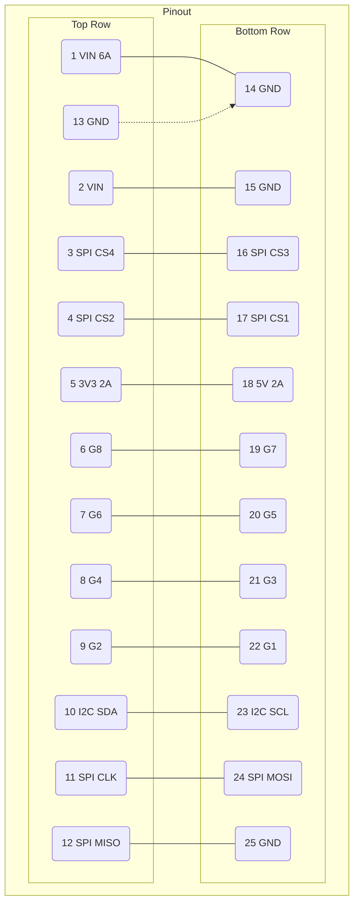

# PMC-C-CMX Datasheet

{/*  */}

Rapidly configurable and deployable system controllers for CM4/5, featuring full HSIO breakouts, STM32H7 for real-time control, B/M key PCIe Gen 3 compatibility and full compatibility with all PMC functional modules.

Advantageous implementation features include:

- Minimal electronic configuration needed for nearly any application
- Logically ordered and labeled IO/management pins
- Standardized DIN rail compatible form factor

### General Specification

|                              |              |     |
| ---------------------------- | ------------ | --- |
| Dimension                    | 190.5 x 72.0 | mm  |
| Underside/top min. clearance | -5.8, +22.0  | mm  |

### Compute Module

|                             |                  |             |
| --------------------------- | ---------------- | ----------- |
| HDMI(R)                     | 2 x              | 4k60p 1.4b  |
| MIPI CSI/DSI                | 2 x 2            | 3/5 Lane    |
| Native USB                  | 4 or 3 or 1\*    | 480Mbps 2.0 |
| PCIe support                | 8GT/s PCIe 3.0   |             |
| PCIe NGFF card form factors | M- 30 x 30/42/80 | mm          |

### General IO

|                            |                                   |
| -------------------------- | --------------------------------- |
| Cellular Capability        | Yes, with Nano-SIM and B-key Card |
| Ethernet                   | 1000-T                            |
| Conforms to RPi HAT spec   | Yes                               |
| Conforms to RPi 40P header | Yes                               |
| Max. Pin-Pin Crosstalk     | 0.25V [PASS]**\***                |

### RS-485 USART transceiver

|                     |             |       |
| ------------------- | ----------- | ----- |
| RS-485              | 20          | Mbps  |
| Transciever IO      | 12/13       | TX/RX |
| PROFIBUS-DP capable | Yes**\*\*** |       |

### ESD protection

|         |                            |
| ------- | -------------------------- |
| HDMI(R) | Yes, IEC 61000-4-2 Level 4 |
| USB     |                            |

### CM Real Time Clock

|                             |              |
| --------------------------- | ------------ |
| RTC Chip                    | PCF85063AT   |
| Crystal Tolerance/Drift     | -6.666666667 |
| Wake-on-alarm and interrupt | Yes          |

### Real Time Controller STM32H7B0

#### General Information

|             |             |           |
| ----------- | ----------- | --------- |
| Flash Size  | 128k/1.4M   | flash/RAM |
| Flash Size  | 128k/1.4M   | flash/RAM |
| Core Clock  | 280         | MHz, max  |
| Ext. Clocks | 16 + 32.768 | MHz, KHz  |
| OTA flash   | Yes\*\*\*   |           |

#### GPIO

|                                    |                            |
| ---------------------------------- | -------------------------- |
| User GPIOs                         | 4x16 + 1x8 \[58 total\]    |
| ESD tolerance                      | IEC 61000-4-2 +-25kv       |
| Max. Pin-Pin Crosstalk             | 0.35V \[PASS\]**\***       |
| Dedicated SWD/ST-LINK(R) interface | Yes (connected to PA13/14) |

### Power Inputs

#### Wire/Line-Pressing terminal input

|                          |         |     |
| ------------------------ | ------- | --- |
| Voltage range            | 7-55/10 | VDC |
| Current Max.             | 10      | ADC |
| Reverse Polarity protect | Yes     |     |

#### USBC-PD R2.0 input

|                        |               |     |
| ---------------------- | ------------- | --- |
| Valid VBUS Voltages    | 44089         | V   |
| Valid PD Powers        | 21+/27+/45+   | W   |
| User-programmable PDOs | Yes**\*\*\*** |     |

#### Power draw

|                                       |             |     |
| ------------------------------------- | ----------- | --- |
| Quiescent draw without compute module | 560 +-20    | mW  |
| Quiescent draw with compute module    | 2200 +-50   | mW  |
| Short-circuit tolerance               | Yes\*\*\*\* |     |

### Onboard Power Converters

|                        |             |                |
| ---------------------- | ----------- | -------------- |
| 5V bus total current   | 5           | ADC            |
| Input-5V efficiency    | 85-92       | %@ 2.5A, 48VIN |
| 5V maximum ripple      | 30          | mV (CCM only)  |
| 3V3 bus total current  | 5           | ADC            |
| Input-3V3 efficiency   | 82-90       | %@ 2.5A, 48VIN |
| 5V maximum ripple      | 20          | mV (CCM only)  |
| 5V GPIO current limit  | Unregulated |                |
| 3V3 GPIO current limit | 1.5         | ADC            |

### LSI Configuration and Pin Table

|                   |            |           |              |
| ----------------- | ---------- | --------- | ------------ |
| CM 4/5            | Definition | CM GPIO   | STM32H7 GPIO |
| ↔                 | UART TX+   | 14        | PA3          |
| STM32H7           | RX+        | 15        | PA2          |
| ↔                 | SPI MISO+  | 9         | PC1          |
| CM 4/5            | MOSI+      | 10        | PC2          |
| 5                 | CLK        | 11        | PB10         |
| 6                 | CS         | Undefined | Undefined    |
| 7                 | SPI MISO   |           |              |
| \[24, 25, 26, 27] | MOSI       |           |              |
| 11                | CLK        |           |              |
| Undefined         | CS \[0-3]  |           |              |
| Undefined         | I²2C SDA   |           |              |
|                   | SCL        |           |              |

The PMC-C-CMX controller is designed and tested to ensure reliable function on the fastest interchip and system data rates.

|                            |     |      |
| -------------------------- | --- | ---- |
| UART/SPI max speed         | 24  | Mbps |
| I2C max speed              | 2   | Mbps |
| UART/SPI maximum rise-time | 9.3 | ns   |
| I²2C maximum rise-time     | 132 | ns   |

### Disclaimers

\*4 USB A ports or 3 USB A ports with populated PCIe B card, or 1 USB-C 2.0 port as master or slave (for EEPROM flash)

** BCM2711 has internal 2.5kV HBM GPIO ESD tolerance \*** OTA capable through UART with supplied program running on compute module, or SWD through additional SKU \*\*\*\* Suitable for live/hot development as 3V3 GPIO to GND does not cause compute module or STM32H7 reboot.

\*\*\*\*\* PASS status is given to the crosstalk spec if the maximum measured induced crosstalk does not exceed 1/2 logic low

**\*\*** Full electronic compliance with PROFIBUS-DP, standardized common connectors available with additional SKUs

**\*\*\*** Programming and MCU interface exposed through onboard 8-pin header
